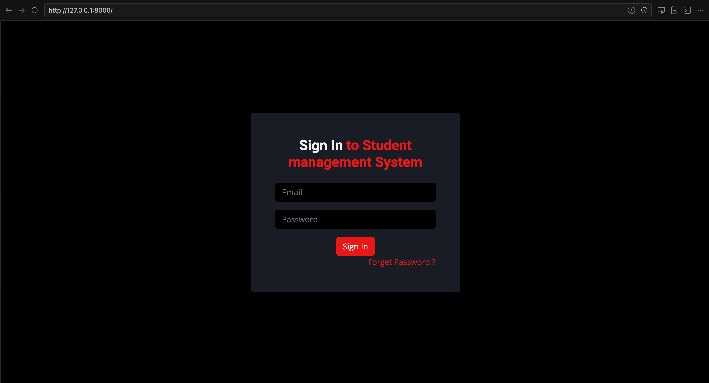
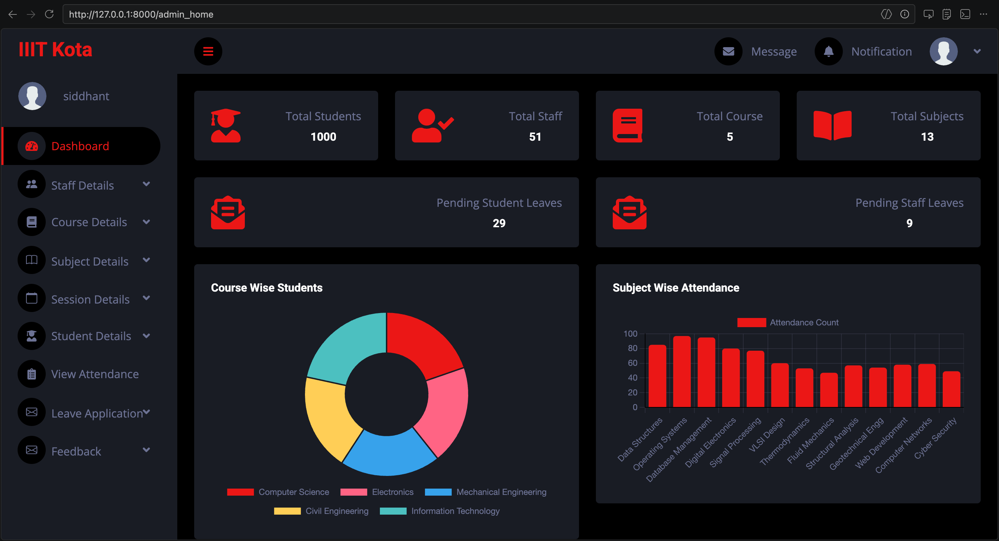

# Student Management System

A web-based student management system built with Django and MySQL. Supports three user roles — **Admin (HOD)**, **Staff**, and **Student** — each with dedicated dashboards and functionality.

## Tech Stack

- **Backend:** Django 4.2 LTS, Python 3.10+
- **Database:** MySQL 8.0+
- **Frontend:** HTML, CSS, JavaScript, Bootstrap, Chart.js
- **Libraries:** PyMySQL, Pillow, python-decouple

## Getting Started

### 1. Clone the repository

```bash
git clone https://github.com/jhasiddhant/student-management-system.git
cd student-management-system
```

### 2. Create and activate a virtual environment

```bash
python -m venv venv
source venv/bin/activate        # macOS / Linux
venv\Scripts\activate           # Windows
```

### 3. Install dependencies

```bash
pip install -r requirements.txt
```

### 4. Create the MySQL database

Log in to the MySQL shell and run:

```sql
CREATE DATABASE sms;
CREATE USER 'sms'@'localhost' IDENTIFIED BY 'password';
GRANT ALL PRIVILEGES ON sms.* TO 'sms'@'localhost';
FLUSH PRIVILEGES;
```

### 5. Configure environment variables

Create a `.env` file in the project root:

```env
SECRET_KEY=your-secret-key-here
DEBUG=True
ALLOWED_HOSTS=localhost,127.0.0.1
DB_ENGINE=django.db.backends.mysql
DB_NAME=sms
DB_USER=sms
DB_PASSWORD=password
DB_HOST=localhost
DB_PORT=3306
```

> **Note:** Generate a proper `SECRET_KEY` for production. You can use `python -c "from django.core.management.utils import get_random_secret_key; print(get_random_secret_key())"`.

### 6. Run migrations

```bash
python manage.py migrate
```

### 7. Create a superuser

```bash
python manage.py createsuperuser
```

### 8. Run the development server

```bash
python manage.py runserver
```

The app will be available at **http://127.0.0.1:8000/**

## Features

- **Admin Dashboard:** Overview charts (course-wise students, subject-wise attendance), pending leave requests, manage staff/students/courses/subjects/sessions
- **Staff Portal:** Mark attendance, add results, apply for leave, send feedback
- **Student Portal:** View attendance and results, apply for leave, send feedback
- **Authentication:** Role-based access control with login middleware
- **Password Reset:** Email-based password recovery

## App Preview






